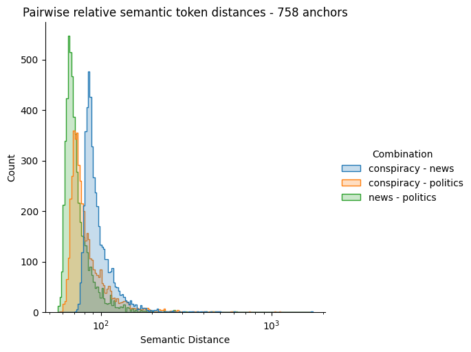

# Semantic Analysis of community languages

This study aims to analyze the semantic distinctions among languages,  considering languages as the semantic structure evident in social media  posts related to specific topics. The dataset comprises three million  posts from the Voat social media platform, categorized into three  topics: politics, news, and conspiracy.

**Note**: At the moment the data on which this analysis was performed is not publicly available.

## Results

In the study, common adjectives across languages are used as anchors because they tend to have universal meanings and describe the properties of nouns, thereby creating a consistent semantic framework.

The figure below illustrates the distribution of semantic differences for each pair of languages.



The analysis reveals that the News-Politics pair exhibits the highest level of affinity, whereas the Conspiracy-News pair demonstrates the greatest disparity. Intriguingly, there appears to be some shared affinity between Conspiracy and Politics.

## The analysis procedure

Let $s\in\mathcal{S}$ be a syntactically defined symbol belonging to the space of all possible symbols $\mathcal{S}$.

Consider a language $L$ as a set of symbols $L : \{s_{1},\dots,s_{|L|}\}$, where each symbol $s_i$ has a specific semantic meaning $z_i\in \mathcal{Z}_l \subset \mathbb{R}^{|z_i|}$. A text $t_l=[s_1,\dots, s_{|t_l|} ]$ is defined as a particular combination with repetition of $|t_l|$ symbols from a specific language $L_l$.

Suppose we have a dataset $\mathcal{D}$ consisting of $n$ texts, which can be categorized into $|\mathcal{L}|$ different languages, denoted by $\mathcal{L}:\{L_1,\dots,L_{|\mathcal{L}|}\}$. A specific text $t_{i,l}$ can then be defined, where $i$ indicates its position in $\mathcal{D}$ and $l$ is the index of the corresponding language such that $L_l\in\mathcal{L}$​.

One way to estimate $\mathcal{Z}_l$ is by using a mapping function $\text{sem}_l(\cdot): \mathcal{S} \to \mathcal{Z}_l$ that maps a symbol $s_i \in L_l$ to its semantic meaning $z_i$​. This function can be modeled with an encoder model architecture, where the encodings capture the semantic meaning of the symbols.

Given two different languages $L_i$ and $L_j$, note that their semantic spaces $\mathcal{Z_i}$ and $\mathcal{Z_l}$ are not directly comparable. Thus, there's a requirement for a common semantic space $\mathcal{R}$ that is language-agnostic.

To address this, anchors $a\in\mathcal{A}\subset S$ are introduced as symbols with a shared semantic meaning across all languages. Subsequently, a mapping function $\text{rel}_{l,\mathcal{A}}(\cdot): \mathcal{Z}_{l} \to \mathcal{R}_{\mathcal{A}} \subset \mathbb{R}^{|\mathcal{A}|}$ can be defined. This function maps the semantic meaning of a specific symbol $s_i\in L_l$ to a relative space shared across all languages.

To summarize:

1. Establish an encoding model architecture $M$.

2. Train distinct instances $M_l$ for each $L_l\in\mathcal{L}$.

3. Obtain the latent representations (encodings) of the language symbols:

$$
z_i=\text{sem}_l(s_i) \quad\forall s_i\in L_j \quad \forall L_j \in \mathcal{L}
$$

4. Defined a set $\mathcal{A}$ and map these encodings into a shared relative space:

$$
r_i = \text{rel}_{l,\mathcal{A}}(z_i) \quad \forall z_i \in \mathcal{Z}_j \quad \forall L_j \in \mathcal{L}   
$$

5. Compute the Euclidean norm between the relative representations of common symbols across two languages:

$$
||\text{rel}_{i, \mathcal{A}}(\text{sem}_i(s_k))-\text{rel}_{j, \mathcal{A}}(\text{sem}_j(s_k))|| \quad \forall s_k \in L_i \cap L_j
$$

$$
||r_{k,i}-r_{k,j}||\quad \forall s_k \in L_i\cap L_j
$$

## Directory Structure

```bash
./root
  |_ .gitignore
  |_ README.md
  |_ flake.lock
  |_ flake.nix
  |_ requirements.txt
  |_ scripts/
  |   |_ adjectives_retrieval.py
  |   |_ instances_training.py
  |   |_ semantic_analysis.py
  |   |_ tokenize_texts.py
  |_ src/
      |_ mappings.py
      |_ tokenizer.py
```

## Setup

### General Setup

1. Clone the repository.
2. **Optional**: It is strongly suggested to create and activate a python virtual environment in the project root folder.
3. Install the needed dependencies.

### For Nix users (most reproducible setup).

Run in the root directory:

```bash
nix develop
```

This will create a nix shell environment from the `flake.nix` with all the needed dependencies.

## Dependencies

- **SpaCy** with the **en_core_web_sm** model: guide for the installation [here](https://spacy.io/usage).
- **Some python modules**: to install them just run in a terminal `pip install -r requirements.txt` from the root directory of the project.

## References

- https://arxiv.org/pdf/2209.15430

## Used Technologies


